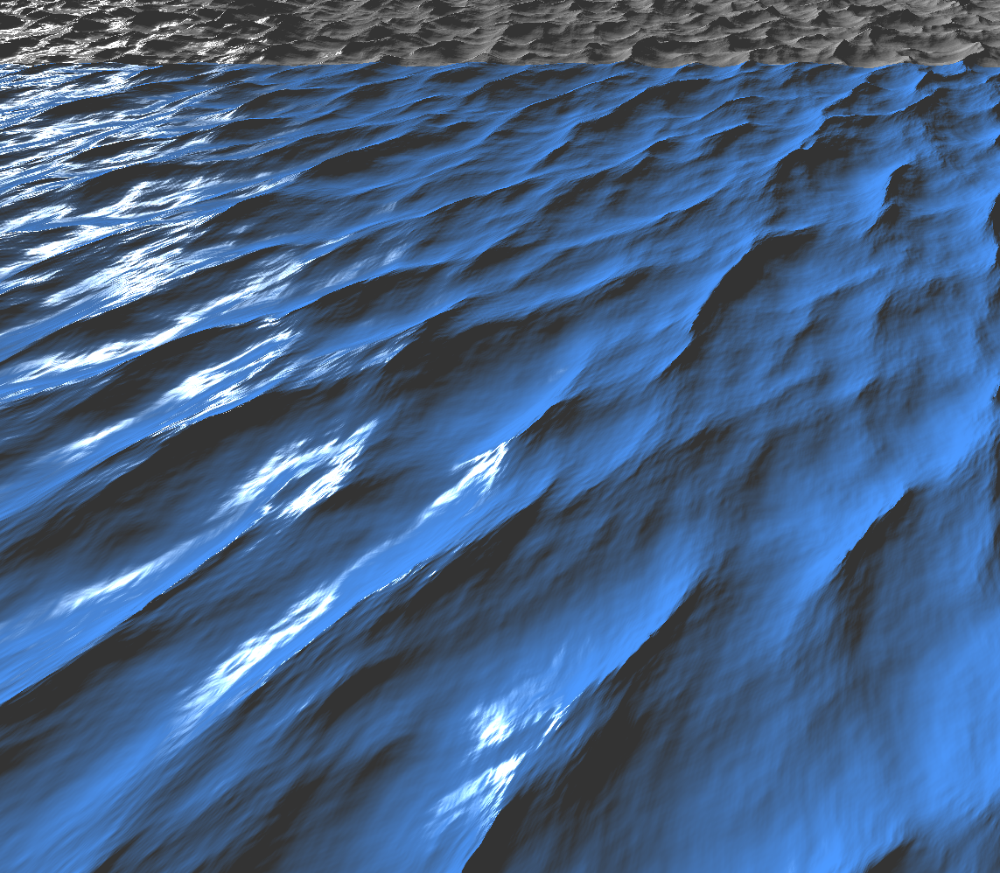

# Water surface wave simulation
Implementation of the wave simulation algorithm described in https://dl.acm.org/doi/10.1145/3197517.3201336

Used technologies:
- C++ for calculations
- OpenGL API for visualization

